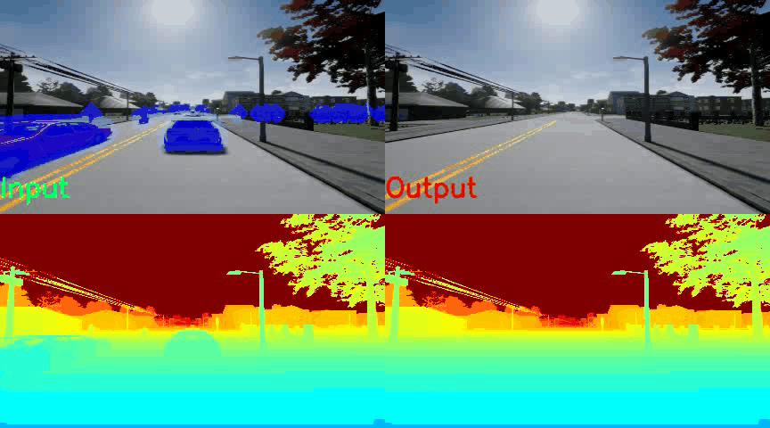

# Abstract

Video inpainting gains an increasing amount of attention ascribed to its wide applications in intelligent video editing. 
However, despite the tremendous progress made in RGB-only video inpainting approaches, existing RGB-D video inpainting models suffer from inadequate and inefficient modal interaction. To make matters even worse, the current RGB-D inpainting datasets are synthesized with homogeneous and delusive RGB-D video data, which cannot provide reliable evaluation for RGB-D video inpainting.

To alleviate these problems, on one hand, we propose a Mutual-guided Color and Depth Inpainting Network (MCD-Net), where color and depth are reciprocally leveraged to inpaint each other, fully exploiting the cross-modal correlation to generate modal-aligned content. 
On the other hand, we build a Video Inpainting with Depth (VID) dataset to supply diverse and authentic RGB-D video data with various object annotation masks to enable more effective verification for RGB-D video inpainting under realistic scenarios. 
Experimental results on the benchmark DynaFill and our collected VID dataset demonstrate that our MCD-Net not only achieves the state-of-the-art quantitative performance but can successfully produce visually-pleasing content for RGB-D videos in real-world.

## A video example of in-the-wild RGB-D video inpainting

We put an in-the-wild video to our model, and the model can be well-generalized to that, making flawless inpainted results.

## More video examples
MCD-Net can be run on a range of scenes including the real-world RGB-D scene (enabled by our VID dataset), the synthetic RGB-D scene (enabled by DynaFill RGB-D video inpainting dataset) and the RGB scene with pseduo depth (enabled by DAVIS dataset).
- *Real-world RGB-D object removal (Our VID dataset):*

- *Simulated RGB-D object removal (DynaFill dataset):*

