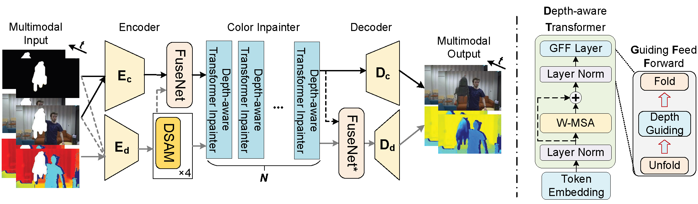

# Mutual Guided Color and Depth Inpainting in RGB-D Videos

Video inpainting gains increasing attention thanks to its wide applications. Despite great progress made in RGB-only video inpainting, existing RGB-D video inpainting models suffer from inadequate modal interaction. To make matters even worse, current RGB-D video inpainting datasets are synthesized with limited scene, which cannot provide effective evaluation. To alleviate these problems, on one hand, we propose a Mutual-guided Color and Depth Inpainting Network (MCD-Net), where color and depth reciprocally inpaint each other to fully exploit cross-modal correlation for the generation of modal-aligned content.  On the other hand, we build a Video Inpainting with Depth (VID) dataset to offer diverse and authentic RGB-D data, supporting a wider range of real-world applications for RGB-D video inpainting. Experimental results on benchmark DynaFill, DAVIS and our collected VID dataset demonstrate that our MCD-Net not only achieves state-of-the-art performance in RGB-D video inpainting but surpasses existing RGB video inpainters in terms of color inpainting. 

## Introduction

## Demo
MCD-Net can be run on a range of scenes including the real-world RGB-D scene (enabled by our VID dataset), the synthetic RGB-D scene (enabled by DynaFill RGB-D video inpainting dataset) and the RGB scene with pseduo depth (enabled by DAVIS dataset).

- **Real-world RGB-D video inpainting: 

