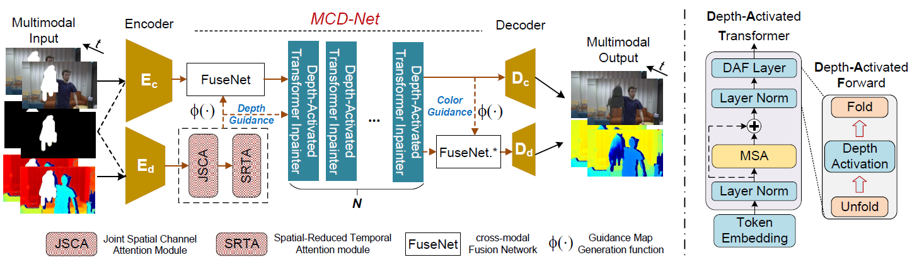

# MCD-Net: Towards Real-World RGB-D Video Inpainting 

Our contribution can be summarized as a *new* model and a *new* dataset.

**1. MCD-Net: using color and depth to mutually and implicitly inpaint each other**
 
We integrate our proposed Depth Completion Network (*i.e.*, the JSCA and SRTA), Depth-Activated Transformer and Fusion Network into one framework for joint color and depth inpainting in RGB-D videos to achieve *SOTA accuracy and runtime*.

**2. VID Dataset: real RGB-D videos with dense annotated masks**
 
We propose the first RGB-D video inpainting dataset (VID) with *authentic* RGB-D data and *elaborately-made masks* to support RGB-D video inpainting. We upload a part of videos and masks in our VID dataset at <a href="https://pan.baidu.com/s/1q9ys6ITxQgtfgYltQbdyvA?pwd=lor3" title="baidu" target="_blank">Baidu</a>.
 
We *manually refine* the object masks automatically generated by TrackAnything. The row 1 and 3 are raw masks. Raw 2 and 4 are our manually-corrected masks to ensure visually-pleasing object removal.

## :newspaper: Abstract
Video inpainting gains an increasing amount of attention ascribed to its wide applications in intelligent video editing. However, despite tremendous progress made in RGB video inpainting, the existing RGB-D video inpainting models still suffer from ineffective modal fusion, as they usually fuse color and depth via explicit feature concatenation, ignoring the natural modal gap between color and depth. To make matters even worse, the current RGB-D inpainting datasets are synthesized with homogeneous and delusive RGB-D video data, which cannot provide reliable evaluation for RGB-D video inpainting.

To alleviate these problems, on one hand, we propose a Mutual-guided Color and Depth Inpainting Network (MCD-Net), where color and depth are reciprocally leveraged to inpaint each other implicitly, mitigating the modal gap and fully exploiting cross-modal association for inpainting. 
On the other hand, we build a Video Inpainting with Depth (VID) dataset to supply diverse and authentic RGB-D video data with various object annotation masks to enable more reliable verification for RGB-D video inpainting under realistic scenes. 
Experimental results on benchmark DynaFill and our collected VID dataset demonstrate that our MCD-Net not only yields the state-of-the-art quantitative performance but can successfully achieve high-quality RGB-D video inpainting in real-world scenes.

## :star: A video example of in-the-wild RGB-D video inpainting

We feed an in-the-wild video (captured in SUSTech) to our model, and the model can be well-generalized to that, making flawless inpainted results.

## :star2: More video examples
We deliver several real-world video examples inpainted by our MCD-Net here. (due to the size of video file, we only present its first frame, *please download the videos in ./demo/ for details*).  

## :clap: Acknowledgement
We acknowledge <a href="https://github.com/gaomingqi/Track-Anything" title="track" target="_blank">Track-Anything</a>, <a href="https://github.com/robot-learning-freiburg/DynaFill/tree/master" title="dynafill" target="_blank">DynaFill</a>, <a href="https://github.com/MCG-NKU/E2FGVI" title="e2fgvi" target="_blank">E2FGVI</a>, <a href="https://github.com/ruiliu-ai/FuseFormer" title="fuseformer" target="_blank">Fuseformer</a>, <a href="https://github.com/researchmm/STTN" title="sttn" target="_blank">STTN</a>, <a href="https://github.com/seoungwugoh/opn-demo" title="opn" target="_blank">OPN</a>, <a href="https://github.com/vt-vl-lab/FGVC" title="fgvc" target="_blank">FGVC</a>, <a href="https://github.com/shleecs/Copy-and-Paste-Networks-for-Deep-Video-Inpainting" title="cpn" target="_blank">CAP</a>, <a href="https://github.com/ruiliu-ai/DSTT" title="dstt" target="_blank">DSTT</a>, <a href="https://github.com/kocchop/depth-completion-gan" title="dstt" target="_blank">SPGAN</a> and <a href="https://github.com/youmi-zym/CompletionFormer" title="cf" target="_blank">CompletionFormer</a> for their awesome works and the spirt of open source !
