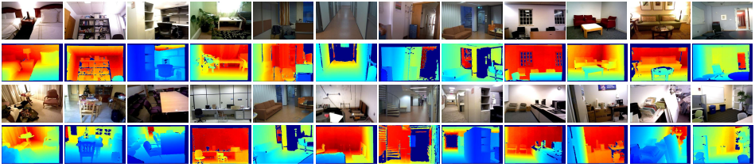

# MCD-Net: Towards Real-World RGB-D Video Inpainting 

Our contribution can be summarized as a *new* model and a *new* dataset.

**1. MCD-Net: using color and depth to mutually inpaint each other**
 
We integrate our proposed Depth Completion Network (*i.e.*, the JSCA and SRTA), Depth-Activated Transformer and Fusion Network into one framework for joint color and depth inpainting in RGB-D videos to achieve *SOTA accuracy and runtime*.

**2. VID Dataset: real RGB-D videos with dense annotated masks**
 
We propose the first RGB-D video inpainting dataset (VID) with *authentic* RGB-D data and *elaborately-made masks* to support RGB-D video inpainting. We upload a part of videos and masks in our VID dataset at <a href="https://baidu.com" title="baidu" target="_blank">Baidu</a>.
 
We manually corrected the masks of VID Dataset. The figures in the previous line show the original masks, and the figures in the next line show the mask manually corrected by us.

# Abstract

Video inpainting gains an increasing amount of attention ascribed to its wide applications in intelligent video editing. 
However, despite the tremendous progress made in RGB-only video inpainting approaches, existing RGB-D video inpainting models suffer from inadequate and inefficient modal interaction. To make matters even worse, the current RGB-D inpainting datasets are synthesized with homogeneous and delusive RGB-D video data, which cannot provide reliable evaluation for RGB-D video inpainting.

To alleviate these problems, on one hand, we propose a Mutual-guided Color and Depth Inpainting Network (MCD-Net), where color and depth are reciprocally leveraged to inpaint each other, fully exploiting the cross-modal correlation to generate modal-aligned content. 
On the other hand, we build a Video Inpainting with Depth (VID) dataset to supply diverse and authentic RGB-D video data with various object annotation masks to enable more effective verification for RGB-D video inpainting under realistic scenarios. 
Experimental results on the benchmark DynaFill and our collected VID dataset demonstrate that our MCD-Net not only achieves the state-of-the-art quantitative performance but can successfully produce visually-pleasing content for RGB-D videos in real-world.

## A video example of in-the-wild RGB-D video inpainting

We put an in-the-wild video (captured in SUSTech) to our model, and the model can be well-generalized to that, making flawless inpainted results.

## More video examples
MCD-Net can be run on a range of scenes including both the real-world RGB-D scene (enabled by our VID dataset) and the synthetic RGB-D scene (enabled by DynaFill RGB-D video inpainting dataset). We present several inpainted examples here. (due to the size of video file, we only present its first frame, please download the videos in ./demo/ for details in video form).  

